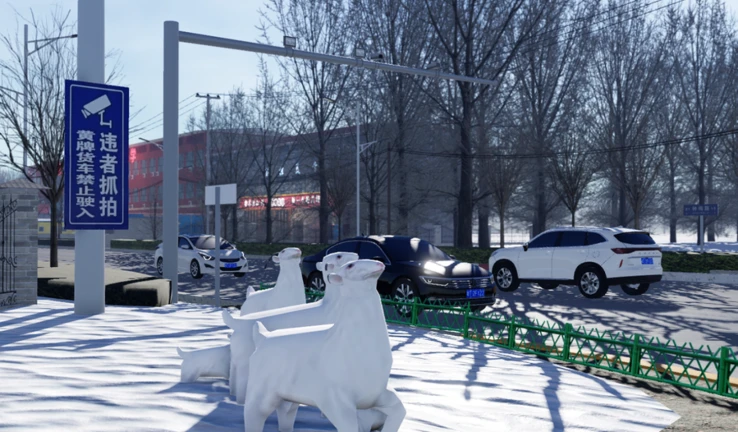

    
    <h1 id="Top">Tang County Issue Tracker</h1>
    <h3>Community issue tracker, discussions for new features and enhancements for Tang County.</h3>
    
    

## Navigation

<nav>
    <ol>
        <li><a href="#Project">Project</a></li>
        <ul>
            <li><a href="#About">About</a></li>
            <li><a href="#Issues">Reporting Issues</a></li>
            <li><a href="#Debugging">Debugging Tools</a></li>
        </ul>
        <li><a href="#Handbook">Maintainer Handbook</a></li>
        <ul>
            <li><a href="#Walkthrough">Walkthrough</a></li>
            <li><a href="#Labels">Labels</a></li>
            <li><a href="#Evaluation">Evaluation</a></li>
            <li><a href="#Advanced">Advanced Practices</a></li>
        </ul>
        <li><a href="#Contributing">Contributing</a></li>
        <li><a href="#Links">Links</a></li>
    </ol>
</nav>

<h2 id="Project">Project</h2>

<h3 id="About">About</h3>

This repository serves as an issue tracker specifically for our Roblox community orientated around the game "Tang County". It aims to make bug reporting and suggestions an easy process. We welcome new contributors and want you to help us build a better environment for our playerbase. We value all kinds of help, you might even get awarded for it!

<h3 id="Issues">Reporting Issues</h3>

Before doing anything, we would like you to read our short guide on how to properly give feedback and criticism. First of all, please use your common senses and make sure to follow our <a href=".github/CODE_OF_CONDUCT.md">Code Of Conduct</a>. For more advanced practices please read the <a href="#Handbook">Maintainer Handbook</a>.

GitHub issues are not only used to report bugs, you can also suggest new features, enhancements and discuss any changes. To open an issue, simply go to the <a hrfer="https://github.com/Hebei-Studios/Tang-County-Issues/issues">issues tab</a>. From there you can pick a template to use. For example, if you want to report a bug inside the game, use the bug report template. If you don't see a common template to use, feel free to make a custom issue with the "other" template or a completely blank issue by selecting this option at the bottom of the template list.

When opening any type of issue, make sure you provide all needed information and reason any changes you want to make. While not enforced, it is highly recommended that you attach any media like images or video about the particular bug/suggestion. This way you help us understand you and what is wrong. Issues that have good proof material will be solved quicker and prioritized over empty issues.

When opening an issue you can also sometimes set certain labels or milestones. If you think that your issue should be under a certain label, please apply it to save us some time. There are certain "special" labels that we use. If you have any doubt, you can head to the labels list and read the description of each one. We use a "stale" bot, it will automatically clean and resolve any old issues that have no activity. This bot gets automatically disabled by applying any of the following labels to an issue/pull-request: <code>no-stale, in-progress, help-wanted, critical, security</code>. When an issue reaches 14 days of inactivity, it will be automatically labeled with the "stale" label, after 7 more days (21 in total) it will be automatically closed as resolved.

You can also check out the <a href="https://github.com/Hebei-Studios/Tang-County-Issues/projects?query=is%3Aopen">projects</a> to have a quick overview of our future plans, what has been completed already, volume of issues and much more. It's a mix between Trello and Notion, if you are familiar with those tools, you won't have any issues learning it.

<h3 id="Debugging">Debugging Tools</h3>

If you are new to reporting issues, don't worry. Here is a quick guide on where to get started. All you need to know is how to screenshot the console logs inside Roblox.

The <a href="https://create.roblox.com/docs/studio/developer-console">developer console</a> in Roblox is a special tool used to check for any warnings or errors from code that runs inside the game. When making any bug report, you must check the logs and give us any output you see in there. What to do if there is an error that is constantly being spammed and you can't see what's happening clearly? Well, if that error is not related to your issue, try to reproduce the issue again in a new server. Please, make sure you don't get confused with an irrelevant error. This can waste a lot of your and our time. To learn more about it, follow the link above straight to the official Roblox documentation. This applies to any other links included in here. What we include here are the basics, you should try it out yourself in any Roblox game to see how it works.

You think there is a memory leak or your computer's RAM is about to explode? Try out the <a href="https://create.roblox.com/docs/studio/optimization/memory-usage">memory usage</a> tab to check your client's memory. Here you can browse through a lot of different categories. A memory leak happens whenever the game wanted to do something, but then it forgot to remove the object, this way it will be kept in memory forever and can stack up until your computer crashes. What to do if a server crashes? Well, you as a normal player can't really do anything useful other than giving us a report. The maximum memory a Roblox server can reach is 6.9GB. (nice) If the whole server crashes without a reason, there may be something on the other end. If you aren't a developer you won't be able to access the server's memory tab. Nevertheless please report it.

Finally, you have access to the <a href="https://create.roblox.com/docs/studio/optimization/scriptprofiler">script profiler</a> and <a href="https://create.roblox.com/docs/studio/microprofiler">micro profiler</a>. Using these tools you can identify scripts that are lagging your game or running too much useless operations. The Roblox documentation has very good explanations of how to use them, so we won't go through it here. Even if you are a mobile player, performance is important and even if you feel the slightest lag spike you should take a look into it. When reporting performance issues, please try to dump the micro profiler logs so we can take a look at them. It only costs you a press of a button and finding the HTML file on your computer.

Without any doubt, the <a href="https://devforum.roblox.com/">Roblox Developer Forum</a> is a golden resource when it comes to learning new stuff or asking questions. If you are still confused on how to use these debugging tools, you might find an better explanation there. Please, make sure you use google and the forum before asking a question here. It might have already been answered somewhere on the internet. We want to keep this guide short for newcomers to read. That's all, thank you for reading!

<h2 id="Handbook">Maintainer Handbook</h2>

This is a short guidance on what exactly you need to do as a "Maintainer". It shows common practices and a certain set of basic rules to follow.

<h3 id="Walkthrough">Walkthrough</h3>

The job of a maintainer is to triage issues, keep everything up-to date and help new users by answering their questions. You don't need to know any programming or be an Insider, none of those skills are needed. While most of the times repository maintainers are also the main contributors of code, it is not required. All you have to do is moderate and evaluate issues. Organization is your main priority.

<h3 id="Labels">Labels</h3>

GitHub has a special feature called "labels". You can tag issues with them. Usually labels are used to categorize bug reports into separate categories or give useful information to other people reading. There are certain categories of labels we have set. Let's see what each category means:
<ul>
    <li>Statuses - these types of label show the status of an issue or pull-request. The evaluating status is applied to all new issues. Your job as a maintainer is to check it out and further apply needed labels according to the type of issue.</li>
    <ul>
        <li>Evaluating - applied to all new issues and pull-requests. A maintainer has to check it out and further apply needed categories of labels.</li>
        <li>Stale - applied to inactive issues or pull-requests. After 14 days of total inactivity the stale bot will apply this label. After 7 more days (21 total) the issue will get closed as resolved automatically.</li>
        <li>No stale - special label to exempt issues from becoming stale. (certain labels can also do this)</li>
        <li>Blocked - this label is applied whenever the given issue or pull-request is blocked by another one. It must wait for something else to get resolved first. Usually the blocking issue is linked. Check advanced practices.</li>
        <li>Help wanted - this status is applied whenever the issue or pull-request is too hard to accomplish and requires someone else to be assigned. (exemption from stale bot)</li>
        <li>Discussion needed - for any tasks that must be discussed first before proceeding with any changes. (exemption from stale bot)</li>
        <li>Investigating - applied whenever someone is taking a look in the issue and is building a solution. (exemption from stale bot)</li>
        <li>Incomplete - the issue or pull-request is missing information or is completely invalid.</li>
        <li>Duplicate - the certain issue already exists somewhere and this is only a duplicate. This also applies to new issues giving more detailed information about an already existing related issue. Instead there should be a comment giving the extra information on the existing issue.</li>
        <li>Wont fix - given to issues that won't be fixed as they are not on our end. Rejected or bad suggestions also apply.</li>
        <li>Monitoring - the issue has been resolved and is currently being monitored to determine if it was resolved or not. Usually the maintainers await an answer from the OP or test manually before closing as resolved.</li>
    </ul>
    <li>Types - this category determines the type of issue, wether it is a bug, feature request or suggestion. Detailed information of these is not included here as they are pretty self-explanatory.</li>
    <li>Semantic Versioning - this category shows how big of a bump this issue will cause for the version. Semantic versioning is a scheme that looks like this: 1.23.4-alpha. You can read more about it <a href="https://semver.org/">here</a>.</li>
    <li>Priorities - this shows the priority of an issue. Higher priorities must be resolved first before others. Security is a special priority. It depends on the context. It doesn't necessarily mean it should have the highest priority. Critical issues should be resolved ASAP, high priority issues affect a lot of users so they should be dealt with quickly, medium after high and low after medium. Self-explanatory. Security and critical labels have an exemption from the stale bot.</li>
    <li>Featuring - this is a special category that tells more context about the issue itself. It might feature "something" in additon. It depends on context and the label itself. For example breaking changes means that fixing this particular issue would bring a lot of other issues that have to be fixed.</li>
    <li>Special - this is the last category that doesn't have a certain "type", those are special labels with their own context that can't be categorized otherwise. For example beginner friendly is a label given for good issues that include a lot of good explanation, context and reasoning.</li>
</ul>
When in ANY doubt about what a label means, you can always check it's description or find more details about it here. A list of all labels can be found <a href="https://github.com/Hebei-Studios/Tang-County-Issues/labels">here</a>.

<h3 id="Evaluation">Evaluation</h3>

As explained in the labels section, evaluation is the process of determining the type of issue and further categorizing it for organization purposes. 

Let's say someone opens a bug report about an animation feeling laggy or jittery. Once looked into, you will probably see that the issue comes from bad performing code. This means that you should apply the performance type label.

Another example would be a bug report/enhancement request that is pointing out a typo somewhere in the code documentation or issue templates. After you confirm it, you can apply the documentation type label.

If you are ever in doubt what label to apply, leave the issue and wait for someone else to look into it. Also don't worry if you make a mistake, you can always revert it! Missunderstandings happen quite oftenly and there is nothing bad about making a mistake. You can also suggest a label change in other issues if you think it will be more appropriate. Always remember to change the status from evaluating to somethign else once you looked into it.

Apply the no stale label for bug reports or more urgent issues. For questions this label is not needed as eventually the issue should be closed. This label only exists for issues that were evaluated, but still require a resolution. Once investigated and fixed, it should be removed so in case where the OP or other people forget that this issue exists, the stale bot will automatically close it as resolved automatically. There are certain labels that already exempt the stale bot from closing them, please refer to the labels section.

<h3 id="Advanced">Advanced Practices</h3>

This section is for more advanced practices like linking issues to pull-requests and vice-versa.

There are certain keywords that you can use to link issues. On GitHub you can refer to an issue by typing "#". For example "#15" would refer to the 15th opened issue. Each issue has it's own unique ID. If you mention issue #16 for example anywhere else, a new activity will appear on the mentioned issue where it will say that it was mentioned somewhere else. This way you can link certain issues with pull-requests and vice-versa. You can also make issues automatically close whenever a certain pull-request is merged. Pull-requests also have unique IDs and work the same way as issues and can be mentioned. To automatically close issues on pull-request merges, you can use the "resolved by #10" keyword. If you type this in the description of an issue, you will link it to that pull-request. You can see an example of this <a href="https://github.com/dphfox/Fusion/pull/329">here</a>. You can check all of these special keywords on the <a href="https://docs.github.com/en/get-started/writing-on-github/working-with-advanced-formatting/using-keywords-in-issues-and-pull-requests">GitHub documentation</a>. This is not the only article about it, there are many more like duplicate issue marking. Make sure you don't miss them out!

You can pin certain issues so they appear on the top of the issues page. This is usually done for commonly reported or duplicated issues. It is also done when there is an urgent issue that needs discussion and resolution. It depends on the situation. You can even pin resolved issues. This is usually done for very common questions a user may ask. People looking the issues page would see the pin and easily avoiding making duplicates.

Projects and Milestones are also a cool feature of GitHub allowing you to get even more organized! Milestones are more simple, you can add an issue to a milestone. When you look at the milestone, you will see the total amount of issues in it and the percentage of progress. When you close an issue, it adds up to the milestone progress. Projects on the other hand are even more advanced allowing you to apply custom filters to issues and quickly overlook them in different table vizualizations.

Locking conversations is also a practice some people use to limit spam comments. If there is too much spam or if you think this issue shouldn't be further discussed you can lock it. This is rarely done as most of the time you never have to do this. It should only be done in extreme scenarios. Someone might want to reply on a closed issue saying that it's still not fixed somewhere or has breaking changes, but he can't as the conversation is locked.

<h2 id="Contributing">Contributing</h2>

There are several ways how you can potentially contribute to this project. One important way to contribute is to actually <i>report bugs/issues</i> you might identify. In addition you can also bring up <i>feature/enhancements</i> requests. Another way is to <i>help translating</i> the README to a wider range of different languages by committing to the <a href="translations">translations</a> folder.
 
Make sure you read the <a href=".github/CODE_OF_CONDUCT.md">Code of Conduct</a> and <a href=".github/CONTRIBUTING.md">Contributing Guide</a> first, as well as all other <a href=".github">support guides</a>.

<h2 id="Links">Links</h2>

* [Game](https://www.roblox.com/games/4618049391)
* [Discord](https://discord.gg/rWGqsAV798)
* [GitHub](https://github.com/Hebei-Studios)
* [Governance](.github/GOVERNANCE.md)
* [Code Of Conduct](.github/CODE_OF_CONDUCT.md)

*Want to get a job here? Feel free to reach out in the Discord server!*

<a href="#Top"><i><u>Back To Top ⬆️</u></i></a>